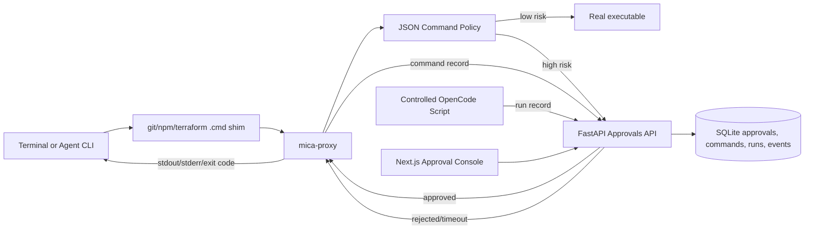

# Mica AgentOps

Mica is an AI Coding Agent execution governance control plane. It is not a new coding agent runtime and not a multi-agent team platform.

The project has been narrowed to a concrete survival path: prove command governance before adding broader AgentOps surfaces. Slice 0 proved Windows command approval proxying, Slice 1 proved OpenCode shim hit detection, and Slice 2 starts running OpenCode under approval gates.

Specs:

- [Slice 0: Windows Command Approval Proxy](docs/slice-0.md)
- [Slice 0: Command Approval Proxy](docs/slice-0-command-approval-proxy.md)
- [Slice 1: Agent CLI Probe](docs/slice-1-agent-cli-probe.md)
- [Slice 2: Controlled OpenCode Approval](docs/slice-2-controlled-opencode-approval.md)
- [Agent Compatibility Matrix](docs/agent-compatibility-matrix.md)
- [Demo Script](docs/demo-script.md)
- [Demo Evidence](docs/demo-evidence.md)
- [Fail-Closed Evidence](docs/fail-closed-evidence.md)
- [Isolation Readiness](docs/isolation-readiness.md)
- [Docker Isolation Spike](docs/docker-isolation-spike.md)
- [Docker Runner](docs/docker-runner.md)
- [Docker Approval Probe Evidence](docs/docker-approval-probe.md)
- [Docker Live Output Evidence](docs/docker-live-output.md)
- [Troubleshooting](docs/troubleshooting.md)

## Current Capability

- FastAPI command approval API backed by SQLite.
- Next.js approval console at `/` and `/approvals`.
- Approval history filters for all, pending, approved, and rejected commands.
- Command records API and `/commands` audit page for proxy-mediated commands.
- Run records, `/runs` page, basic run summaries, and failure summaries for controlled Agent CLI sessions.
- Interactive Web Agent Runs from natural-language prompts with `mock-agent` and real local `opencode` discovery/execution.
- Run-scoped command evidence via `/commands?run_id=...` and a Run Evidence table that separates Docker wrapper commands from policy-gated inner commands.
- Event records API, SSE stream, historical event replay, and run-scoped Trace Events plus Realtime Logs panels on `/runs`.
- Python `mica-proxy` module with JSON command policy loading.
- Probe mode for recording shim hits without blocking commands.
- `mica_probe` summary CLI for hit-rate matrices.
- `mica_eval` summary CLI with five starter eval cases and sample cross-agent report.
- Codex CLI probe script via `scripts/probe-codex.ps1`, with real local `hit_rate=1.0` evidence recorded.
- Claude Code and Gemini CLI probe scripts, ready for local verification when those CLIs are installed.
- Controlled OpenCode approval runner via `scripts/run-controlled-opencode.ps1`.
- Web-launched OpenCode runs inject controlled PATH, `MICA_ORIGINAL_PATH`, `MICA_API_BASE_URL`, and `MICA_RUN_ID` so proxy-mediated command evidence can attach to the same run.
- Minimal Docker runner plus an experimental API/service evidence bridge that records Docker executions as Mica runs, commands, events, network policy decisions, workspace file-change evidence, and Docker network-mode evidence.
- Optional Docker proxy injection plumbing with Linux shims, proxy mount, policy mount, and controlled container PATH.
- Real Docker approval probe evidence for rejected high-risk `git push` through container shims, with the inner proxy command linked back to the same Docker run summary.
- Real Docker live-output evidence: container stdout/stderr lines are written as `command_output` trace events while the command is still running and are visible in the `/runs` Realtime Logs panel.
- Docker demo capture script that runs the approval probe and exports run summary, command records, trace events, file-change events, network evidence, and approval records into a Markdown report.
- Docker network policy file at `policies/docker-policy.json` for allowed network modes and the explicit host-callback gate.
- Windows `.cmd` shims for `git`, `npm`, `terraform`, and `kubectl`.
- PowerShell helper scripts for installing shims, probing PATH, and probing OpenCode.
- Backend tests for command approvals, risk detection, probe mode, controlled OpenCode approval mode, real executable resolution, and command exit-code passthrough.

## Honest Boundaries

- Slice 0 governs external binaries that resolve through PATH shims.
- It does not reliably intercept PowerShell or cmd built-ins such as `Remove-Item`, `del`, `rmdir`, or `cd`.
- Local mode is not a strong security sandbox. Absolute executable paths, direct library calls, or hostile child processes can bypass PATH shims.
- If the approval API is unavailable or an approval times out, `mica-proxy` fails closed instead of executing the command.
- Strong isolation is deferred to Docker, WSL2, or remote worker slices.

## Command Policy

Default command policy lives at `policies/command-policy.json`.

Each rule matches an external binary command by tool name and argv prefix:

```json
{
  "id": "kubectl-delete",
  "tool": "kubectl",
  "argv_prefix": ["delete"],
  "action": "require_approval",
  "risk_level": "high",
  "reason": "kubectl delete can remove cluster resources."
}
```

Use a custom policy file for a run:

```powershell
$env:MICA_POLICY_FILE = "C:\path\to\command-policy.json"
.\scripts\run-controlled-opencode.ps1 -Prompt "Run kubectl delete pod mica-test exactly once."
```

The command is governable only if a matching shim exists and the Agent CLI resolves the tool through PATH. The current repo includes shims for `git`, `npm`, `terraform`, and `kubectl`.

## Docker Network Policy

Default Docker network policy lives at `policies/docker-policy.json`.

```json
{
  "version": 1,
  "network": {
    "allowed_modes": ["none", "bridge"],
    "require_host_callback_for_bridge": true,
    "require_proxy_injection_for_bridge": true
  }
}
```

`POST /api/docker/execute` loads this policy before invoking Docker. By default, `network_mode=none` is allowed and `network_mode=bridge` is allowed only when the request sets both `allow_host_callback=true` and `inject_proxy=true`. Allowed executions record a `policy_decision` trace event before Docker starts, so the run timeline shows which policy allowed the network mode. This keeps host API callback requirements explicit for containerized approval probes while preserving fail-closed behavior for accidental bridge networking. This is request validation and audit evidence, not packet-level egress enforcement.

## Architecture



## Quick Start

Prerequisites:

- Windows PowerShell
- Python 3.12+
- uv 0.11+
- Node.js 24+
- pnpm 11+

Install dependencies:

```powershell
pnpm install
cd apps/api
uv sync
cd ../..
```

Run the API:

```powershell
pnpm dev:api
```

Run the Web console in another terminal:

```powershell
pnpm dev:web
```

Open:

- Web UI: http://localhost:3000
- API health: http://localhost:8000/health
- API docs: http://localhost:8000/docs

## Install Command Shims

Generate shims and print the controlled PATH commands:

```powershell
.\scripts\install-shims.ps1
```

Apply the printed environment commands in the terminal where you want command governance:

```powershell
$env:MICA_ORIGINAL_PATH = '<printed original PATH>'
$env:PATH = '<repo>\shims;' + $env:MICA_ORIGINAL_PATH
$env:MICA_API_BASE_URL = 'http://localhost:8000/api'
```

`mica-proxy` also accepts the earlier Slice 0 name `MICA_API_URL`; `MICA_API_BASE_URL` takes precedence when both are set.

Probe resolution:

```powershell
.\scripts\probe-path.ps1
```

## Test Slice 0 Manually

Use a local bare repository. Do not test `git push` against a real remote.

```powershell
mkdir $env:TEMP\mica-slice0
cd $env:TEMP\mica-slice0
git init --bare remote.git
git clone remote.git work
cd work
"hello" | Set-Content README.md
git add README.md
git commit -m "init"
git remote -v
```

Expected checks:

- `git status` passes through normally.
- `git push origin main` or `git push origin master` creates a pending Web approval and blocks the terminal.
- Rejecting in Web prints `MICA_APPROVAL_REJECTED` and exits `126`.
- Running again and approving executes the real `git.exe`; stdout/stderr/exit code pass through.
- SQLite stores the command approval record.

You can also run the scripted local verification against a running API:

```powershell
pnpm dev:api
.\scripts\verify-slice0.ps1 -AutoDecision rejected -ApiBaseUrl http://localhost:8000/api
```

This creates a throwaway local bare repository, injects Mica shims for the verification shell, checks `git status`, runs `git push origin main`, auto-rejects the pending approval, and expects exit code `126`.

A real local run is captured in [docs/demo-evidence.md](docs/demo-evidence.md).

## Probe OpenCode

Slice 1 adds observational probe mode. It records whether an Agent CLI actually reaches Mica shims, without blocking commands or creating approvals.

Run:

```powershell
.\scripts\probe-opencode.ps1
```

The script requires OpenCode to be installed as `opencode`. It runs `git status`, `npm -v`, and `terraform --version` through `opencode run --auto`, writes `.mica/opencode-probe.jsonl`, and prints a hit-rate matrix.

If OpenCode is not installed, the script exits `2`; that is an environment gap, not a governance result.

The total hit count may be larger than the three requested commands because OpenCode can invoke extra external commands internally, especially `git` commands for repository detection and snapshots. For Slice 1, the key signal is whether every expected tool has at least one shim hit.

Current OpenCode probe evidence is summarized in [docs/opencode-probe-report.md](docs/opencode-probe-report.md).

Summarize any probe log manually:

```powershell
$env:PYTHONPATH = ".\proxy"
python -m mica_probe --log .mica\opencode-probe.jsonl --expect git,npm,terraform
```

## Probe Codex CLI

Slice 3 starts by probing Codex CLI with the same PATH shim mechanism:

```powershell
.\scripts\probe-codex.ps1
```

The script requires Codex CLI to be installed as `codex`. It runs `codex exec -C <repo> <prompt>`, writes `.mica/codex-probe.jsonl`, and prints a hit-rate matrix for `git`, `npm`, and `terraform`.

If Codex CLI is not installed, the script exits `2`. Probe results should be recorded in [docs/codex-probe-report.md](docs/codex-probe-report.md) and summarized in [docs/agent-compatibility-matrix.md](docs/agent-compatibility-matrix.md).

## Probe Claude Code and Gemini CLI

Claude Code and Gemini CLI use the same PATH shim probe flow:

```powershell
.\scripts\probe-claude.ps1
.\scripts\probe-gemini.ps1
```

The Claude probe invokes `claude -p <prompt>`. The Gemini probe invokes `gemini -p <prompt>`. Each script writes a JSONL probe log under `.mica`, summarizes expected `git`, `npm`, and `terraform` hits, and exits `2` if the CLI is not installed.

Current local evidence is still pending for both CLIs on this machine. Do not claim command governance for Claude Code or Gemini CLI until their probe logs show the expected shim hits and [docs/agent-compatibility-matrix.md](docs/agent-compatibility-matrix.md) is updated with real results.

## Generate Eval Report

Mica includes a small offline eval suite under `evals/cases`:

- `git-status`
- `npm-version`
- `terraform-version`
- `risky-git-push`
- `risky-terraform-apply`

Generate a report from JSONL results:

```powershell
$env:PYTHONPATH = ".\proxy"
python -m mica_eval --cases evals\cases --results evals\results\sample-results.jsonl --format markdown --out docs\eval-report.md
```

The report includes success rate, average duration, approval count, rejected count, risky command count, and per-agent metrics. See [docs/eval-report.md](docs/eval-report.md).

Run eval cases through an agent command in probe mode:

```powershell
.\scripts\run-eval.ps1 -AgentName codex -AgentKind codex -AgentCommand codex
```

Supported `AgentKind` values are `command`, `codex`, `opencode`, `claude`, and `gemini`. The runner injects Mica shims, enables probe mode, executes each case, writes JSONL results, and regenerates the markdown report. In probe mode it measures observed and risky commands, but it does not create approvals.

Examples:

```powershell
.\scripts\run-eval.ps1 -AgentName claude -AgentKind claude -AgentCommand claude
.\scripts\run-eval.ps1 -AgentName gemini -AgentKind gemini -AgentCommand gemini
```

The Claude and Gemini eval modes use the same `-p <prompt>` entrypoint as their probe scripts. Run their probe scripts first and update the compatibility matrix before treating approval-mode eval results as governance evidence.

Run eval cases against the live approval API:

```powershell
pnpm dev:api
.\scripts\run-eval.ps1 -AgentName opencode -AgentKind opencode -AgentCommand opencode -EvalMode approval -ApiBaseUrl http://localhost:8000/api
```

Approval mode creates a run per case, sets `MICA_RUN_ID`, lets `mica-proxy` create command and approval records, finishes the run, and reads `/api/runs/{id}/summary` for approval, rejection, risky-command, and command-count metrics. High-risk cases can block until approved, rejected, or timed out.

For repeatable risky eval cases, use non-interactive approval decisions:

```powershell
.\scripts\run-eval.ps1 -AgentName opencode -AgentKind opencode -AgentCommand opencode -EvalMode approval -AutoDecision rejected -ApiBaseUrl http://localhost:8000/api
.\scripts\run-eval.ps1 -AgentName opencode -AgentKind opencode -AgentCommand opencode -EvalMode approval -AutoDecision approved -ApiBaseUrl http://localhost:8000/api
```

`-AutoDecision` polls pending approvals and decides them as `mica-eval`. Use it only in local throwaway workspaces or fake remotes, because `approved` will execute the real command after policy approval.

## Run OpenCode With Approval Gates

After probe mode confirms OpenCode hits the shims, run OpenCode in approval mode:

```powershell
pnpm dev:api
pnpm dev:web
.\scripts\run-controlled-opencode.ps1 -Prompt "Run git push origin main exactly once. Do not edit files."
```

Use this only inside a local test repository with a local bare `origin` remote. The script puts `shims/` first in PATH, clears probe mode, sets `MICA_API_BASE_URL`, creates a Mica run record, injects `MICA_RUN_ID`, and runs `opencode run --auto`.

Expected flow:

- `git push` creates a pending command approval and blocks the OpenCode child process.
- The Web console at `http://localhost:3000/approvals` shows the approval card.
- Reject returns `MICA_APPROVAL_REJECTED` and exit code `126`.
- Approve executes the real `git` command and preserves stdout, stderr, and exit code.
- Command records are linked to a run visible at `http://localhost:3000/runs`.
- Finishing the OpenCode process updates the run summary with command counts, approval count, total duration, and failure details.
- The `/runs` page shows trace events such as run creation, approval required, approval rejected/approved, command finished, and run completed/failed. It also shows line-oriented `command_output` events in a monospace Realtime Logs panel with historical replay plus SSE append.

## API

Create approval:

```http
POST /api/approvals
```

List approvals:

```http
GET /api/approvals?status=pending
```

Read approval:

```http
GET /api/approvals/{id}
```

Decide approval:

```http
POST /api/approvals/{id}/decide
```

List command records:

```http
GET /api/commands
```

List command records for one run:

```http
GET /api/commands?run_id={id}
```

Create command record:

```http
POST /api/commands
```

Finish command record:

```http
PATCH /api/commands/{id}/finish
```

Create an Agent Run from the Web UI:

```text
http://localhost:3000/runs
```

Use the `Start Agent Run` panel to submit a natural-language task prompt, workspace, agent, and runner mode. The interactive slice supports:

- `mock-agent`: a deterministic no-dependency smoke test that records the prompt, creates a small plan, writes command evidence, and completes immediately.
- `opencode`: a real local Agent CLI run launched as a child process under Mica's controlled PATH. Mica injects `MICA_RUN_ID`, `MICA_ORIGINAL_PATH`, `MICA_API_BASE_URL`, and the repo `shims/` directory so shim/proxy command records and approvals can be grouped under the same run.

The UI reads `GET /api/agent-runs/agents` to show whether OpenCode is installed. If OpenCode is unavailable, the option is disabled with the backend reason. Codex and other real agent adapters remain probe/roadmap items and are not enabled from the Web UI by default.

Use `Advanced: Execute Docker Command` only when you want to dogfood the lower-level Docker execution path directly with a command JSON array. That panel calls `POST /api/docker/execute`.

Start Agent Run from API:

```http
POST /api/agent-runs
```

```json
{
  "prompt": "Check git status and summarize uncommitted changes.",
  "workspace": "C:\\path\\to\\repo",
  "agent_type": "opencode",
  "runner_mode": "local"
}
```

List interactive agent availability:

```http
GET /api/agent-runs/agents
```

Cancel a running interactive Agent Run:

```http
POST /api/agent-runs/{id}/cancel
```

List runs:

```http
GET /api/runs
```

Create run:

```http
POST /api/runs
```

Finish run:

```http
PATCH /api/runs/{id}/finish
```

Read run summary:

```http
GET /api/runs/{id}/summary
```

List trace events:

```http
GET /api/events?run_id={id}
```

Stream trace events with SSE:

```http
GET /api/events/stream?run_id={id}
```

Replay existing events and close the stream:

```http
GET /api/events/stream?run_id={id}&replay=true
```

Execute one command in Docker and record run evidence:

```http
POST /api/docker/execute
```

```json
{
  "workspace": "C:\\path\\to\\throwaway-workspace",
  "image": "python:3.12-slim",
  "command": ["python", "-c", "print('hello from docker')"]
}
```

Enable opt-in proxy injection for a Docker approval probe:

```json
{
  "workspace": "C:\\path\\to\\throwaway-workspace",
  "image": "mica-python-git:local",
  "command": ["git", "status"],
  "inject_proxy": true,
  "network_mode": "bridge",
  "allow_host_callback": true,
  "api_base_url": "http://host.docker.internal:8000/api"
}
```

`network_mode=bridge` is rejected unless it is allowed by `policies/docker-policy.json` and both `allow_host_callback=true` and `inject_proxy=true` are present. Use that opt-in only when the containerized proxy must call back to the host Mica API, such as an approval probe.

Decision payload:

```json
{
  "decision": "approved",
  "resolved_by": "web",
  "comment": "local bare repo test"
}
```

## Testing

Backend:

```powershell
pnpm test:api
```

Frontend:

```powershell
pnpm lint:web
pnpm build:web
```

Full local check:

```powershell
pnpm test
pnpm build:web
```

Focused fail-closed check:

```powershell
cd apps\api
uv run pytest tests/test_mica_proxy.py -k "times_out or fails_closed"
```

Isolation readiness check:

```powershell
.\scripts\check-isolation-readiness.ps1 -ReportPath docs\isolation-readiness.md
```

This only checks whether Docker or WSL2 appear available for a stronger isolation slice. It does not change Local mode's security boundary.

Docker isolation spike:

```powershell
.\scripts\verify-docker-isolation.ps1 -Image python:3.12-slim -ReportPath docs\docker-isolation-spike.md
```

This runs a disposable container with `--rm`, `--network none`, and a throwaway mounted workspace. It verifies the isolation direction, but it is still not a full Docker mode with policy injection.

Minimal Python Docker runner:

```powershell
cd apps\api
uv run pytest tests/test_docker_runner.py
uv run pytest tests/test_docker_execution_service.py
uv run pytest tests/test_docker_execute_api.py
```

See [docs/docker-runner.md](docs/docker-runner.md). The runner returns stdout, stderr, exit code, duration, image, workspace, and network mode. `DockerExecutionService` and `POST /api/docker/execute` can record a Docker command as a Mica run, command, `command_output`, and trace event chain. Docker mode has optional proxy injection plumbing for `/mica/shims`, `/mica/proxy`, and policy mounts. Docker stdout/stderr is now written as line-oriented `command_output` events while the command is still running; see [docs/docker-live-output.md](docs/docker-live-output.md). Docker API network-mode validation is configured in `policies/docker-policy.json`.

Docker approval probe script:

```powershell
.\scripts\build-docker-probe-image.ps1 -Image mica-python-git:local

pnpm dev:api
.\scripts\verify-docker-approval-probe.ps1 `
  -Image mica-python-git:local `
  -AutoDecision rejected `
  -NetworkMode bridge `
  -ApiBaseUrl http://localhost:8000/api `
  -ContainerApiBaseUrl http://host.docker.internal:8000/api
```

The build script creates a local `mica-python-git:local` image from `docker/mica-python-git.Dockerfile`. The image contains Python plus Git, which is enough for the default `git push origin main` approval probe. The probe script posts to `/api/docker/execute` with `inject_proxy=true`, `network_mode=bridge`, and `allow_host_callback=true`; it polls pending approvals, auto-decides them when requested, and expects rejected probes to return exit code `126`. `ApiBaseUrl` is used by the host-side script; `ContainerApiBaseUrl` is injected into the container for `mica-proxy` to call back to the host API. Docker execution defaults to `network_mode=none`; this probe intentionally uses `bridge` so the container can reach the host API. The bridge mode must also be allowed by `policies/docker-policy.json`, and the default policy reserves bridge mode for proxy-injected approval probes.

Capture a demo report:

```powershell
.\scripts\capture-docker-demo.ps1 `
  -Image mica-python-git:local `
  -AutoDecision rejected `
  -NetworkMode bridge `
  -ApiBaseUrl http://localhost:8000/api `
  -ContainerApiBaseUrl http://host.docker.internal:8000/api `
  -ReportPath docs\docker-demo-capture.md
```

The capture script reuses the approval probe, then fetches `/api/commands?run_id=...`, `/api/events?run_id=...`, `/api/runs/{id}/summary`, and `/api/approvals`. It writes a Markdown report with the command evidence, trace events including `policy_decision`, `file_changed`, and `network_evidence` records, approval decision, failure summary, stderr evidence such as `MICA_APPROVAL_REJECTED`, and the Local-mode security boundary.

## Roadmap

- Slice 1: probe OpenCode with controlled PATH and verify shim hit rate.
- Slice 2: policy files, command records, run records, run summaries, failure summaries, persisted trace events, and SSE for proxy-mediated commands.
- Slice 3: real Claude/Gemini CLI probes, cross-agent eval comparisons, richer Docker policy enforcement, and WSL2/remote-worker isolation.

## Resume Description

Mica AgentOps: built a Windows-first Coding Agent execution governance prototype with PATH shims, a Python command proxy, FastAPI approval API, SQLite audit records, and a Next.js approval console. The project focuses on policy-gated command execution for local Agent CLI runtimes, with future slices planned for probe-based agent compatibility, trace evidence, evals, and stronger sandbox isolation.
