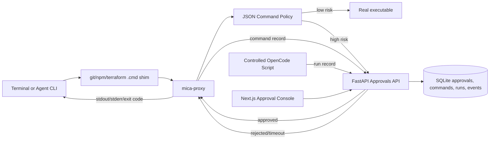

# Mica AgentOps

Mica is a Windows-first AI Coding Agent execution governance control plane. It supervises existing Agent CLI runtimes instead of implementing another agent or multi-agent team platform.

The MVP proves a concrete path from natural-language work to governed execution: persistent Agent sessions and runs, native runtime adapters, PATH-shim command interception, human approval gates, trace evidence, and execution summaries. Local mode remains an auditable governance layer rather than a strong security sandbox.

## Release Status

Mica is a working open-source MVP suitable for local demonstrations and engineering exploration. The command approval path, run/session model, OpenCode and Codex integrations, trace storage, SSE API, and Web console are implemented and covered by automated tests. Docker isolation, native-session command enforcement, distributed execution, authentication, and multi-tenancy remain experimental or future work.

Specs:

- [Slice 0: Windows Command Approval Proxy](docs/slice-0.md)
- [Slice 0: Command Approval Proxy](docs/slice-0-command-approval-proxy.md)
- [Slice 1: Agent CLI Probe](docs/slice-1-agent-cli-probe.md)
- [Slice 2: Controlled OpenCode Approval](docs/slice-2-controlled-opencode-approval.md)
- [Agent Compatibility Matrix](docs/agent-compatibility-matrix.md)
- [Demo Script](docs/demo-script.md)
- [Demo Evidence](docs/demo-evidence.md)
- [Fail-Closed Evidence](docs/fail-closed-evidence.md)
- [Isolation Readiness](docs/isolation-readiness.md)
- [Docker Isolation Spike](docs/docker-isolation-spike.md)
- [Docker Runner](docs/docker-runner.md)
- [Docker Approval Probe Evidence](docs/docker-approval-probe.md)
- [Docker Live Output Evidence](docs/docker-live-output.md)
- [Troubleshooting](docs/troubleshooting.md)

## Current Capability

### Stable MVP

- FastAPI, SQLAlchemy, and SQLite APIs for sessions, runs, commands, approvals, interactions, events, and summaries.
- Next.js consoles for Agent Sessions, Runs, Command Approvals, Command Records, realtime logs, and trace evidence.
- Natural-language execution through `mock-agent`, OpenCode, Codex CLI, and Antigravity CLI adapters.
- Agent-native session continuity: OpenCode server sessions and Codex thread resume, without rebuilding context from Mica transcripts.
- Structured session interactions for text, single-choice, multi-choice, and native permission/question events where the runtime exposes them.
- JSON command policy, Windows `.cmd` PATH shims, Python `mica-proxy`, fail-closed approval waits, and stdout/stderr/exit-code passthrough.
- Run-scoped command and approval evidence, persisted trace events, historical replay, SSE updates, and completion/failure summaries.
- Probe and eval utilities for measuring shim hits and comparing basic runtime outcomes.

### Experimental

- Codex `app-server` transport for deeper native thread and turn events; stable `codex exec resume` remains the fallback.
- Docker command execution, proxy injection, network-policy decisions, workspace evidence, and live output capture.
- Heuristic interaction detection when an Agent runtime does not emit a structured question or permission event.

### Adapter Maturity

| Adapter | One-shot run | Native continuation | Structured interaction | Notes |
| --- | --- | --- | --- | --- |
| OpenCode | Yes | HTTP server session | Questions and permissions | Primary session adapter |
| Codex CLI | Yes | Thread resume | Single-choice/native events where available | App-server path is experimental |
| Antigravity CLI | Yes | Process-level follow-up only | No guaranteed native contract | Best suited to one-shot runs |
| Mock Agent | Yes | Deterministic test flow | Test fixtures | No external dependency |

## Honest Boundaries

- Slice 0 governs external binaries that resolve through PATH shims.
- It does not reliably intercept PowerShell or cmd built-ins such as `Remove-Item`, `del`, `rmdir`, or `cd`.
- Local mode is not a strong security sandbox. Absolute executable paths, direct library calls, or hostile child processes can bypass PATH shims.
- If the approval API is unavailable or an approval times out, `mica-proxy` fails closed instead of executing the command.
- Native OpenCode or Codex session turns are not yet guaranteed to route every command through a run-scoped shim environment. The UI distinguishes observed runtime activity from proxy-governed evidence.
- Realtime behavior varies by adapter. Proxy, process, Docker, and OpenCode events are persisted progressively; some Codex app-server events are finalized in batches.
- A native runtime can remain busy after a child tool stalls or retains stdio handles. Mica currently times out the run, but automatic native-session abort and stalled-tool recovery are still roadmap work.
- Strong isolation is deferred to Docker, WSL2, or remote worker slices.

## Command Policy

Default command policy lives at `policies/command-policy.json`.

Each rule matches an external binary command by tool name and argv prefix:

```json
{
  "id": "kubectl-delete",
  "tool": "kubectl",
  "argv_prefix": ["delete"],
  "action": "require_approval",
  "risk_level": "high",
  "reason": "kubectl delete can remove cluster resources."
}
```

Use a custom policy file for a run:

```powershell
$env:MICA_POLICY_FILE = "C:\path\to\command-policy.json"
.\scripts\run-controlled-opencode.ps1 -Prompt "Run kubectl delete pod mica-test exactly once."
```

The command is governable only if a matching shim exists and the Agent CLI resolves the tool through PATH. The current repo includes shims for `git`, `npm`, `terraform`, and `kubectl`.

## Docker Network Policy

Default Docker network policy lives at `policies/docker-policy.json`.

```json
{
  "version": 1,
  "network": {
    "allowed_modes": ["none", "bridge"],
    "require_host_callback_for_bridge": true,
    "require_proxy_injection_for_bridge": true
  }
}
```

`POST /api/docker/execute` loads this policy before invoking Docker. By default, `network_mode=none` is allowed and `network_mode=bridge` is allowed only when the request sets both `allow_host_callback=true` and `inject_proxy=true`. Allowed executions record a `policy_decision` trace event before Docker starts, so the run timeline shows which policy allowed the network mode. This keeps host API callback requirements explicit for containerized approval probes while preserving fail-closed behavior for accidental bridge networking. This is request validation and audit evidence, not packet-level egress enforcement.

## Architecture

### Session vs Run

Mica separates long-lived work from process execution:

```text
AgentSession = persistent goal, display messages, and native Agent session/thread handle
  -> SessionMessage = user/agent turns
  -> Run = one Agent CLI invocation
      -> Command / Approval / Event = governance evidence
```

Mica does not rebuild Agent state from its own transcript. OpenCode Sessions use `opencode serve` and send turns through the OpenCode HTTP API with the captured OpenCode session id. Codex Sessions use a two-layer adapter: the default stable path uses the captured Codex thread id through `codex exec resume`, while `MICA_CODEX_SESSION_TRANSPORT=app-server` enables the native `codex app-server` JSON-RPC path with `thread/start`, `thread/resume`, and `turn/start`. If no native handle has been captured yet, the next turn falls back to a one-shot prompt with only the latest user message. If an agent exits after asking for user input, Mica keeps the Session in `waiting_user_input` while the underlying Run can still be `completed`.



## Quick Start

Prerequisites:

- Windows PowerShell
- Python 3.12+
- uv 0.11+
- Node.js 24+
- pnpm 11+

Install dependencies:

```powershell
pnpm install
cd apps/api
uv sync
cd ../..
```

Run the API:

```powershell
pnpm dev:api
```

Run the Web console in another terminal:

```powershell
pnpm dev:web
```

Open:

- Web UI: http://localhost:3000
- API health: http://localhost:8000/health
- API docs: http://localhost:8000/docs

## Install Command Shims

Generate shims and print the controlled PATH commands:

```powershell
.\scripts\install-shims.ps1
```

Apply the printed environment commands in the terminal where you want command governance:

```powershell
$env:MICA_ORIGINAL_PATH = '<printed original PATH>'
$env:PATH = '<repo>\shims;' + $env:MICA_ORIGINAL_PATH
$env:MICA_API_BASE_URL = 'http://localhost:8000/api'
```

`mica-proxy` also accepts the earlier Slice 0 name `MICA_API_URL`; `MICA_API_BASE_URL` takes precedence when both are set.

Probe resolution:

```powershell
.\scripts\probe-path.ps1
```

## Test Slice 0 Manually

Use a local bare repository. Do not test `git push` against a real remote.

```powershell
mkdir $env:TEMP\mica-slice0
cd $env:TEMP\mica-slice0
git init --bare remote.git
git clone remote.git work
cd work
"hello" | Set-Content README.md
git add README.md
git commit -m "init"
git remote -v
```

Expected checks:

- `git status` passes through normally.
- `git push origin main` or `git push origin master` creates a pending Web approval and blocks the terminal.
- Rejecting in Web prints `MICA_APPROVAL_REJECTED` and exits `126`.
- Running again and approving executes the real `git.exe`; stdout/stderr/exit code pass through.
- SQLite stores the command approval record.

You can also run the scripted local verification against a running API:

```powershell
pnpm dev:api
.\scripts\verify-slice0.ps1 -AutoDecision rejected -ApiBaseUrl http://localhost:8000/api
```

This creates a throwaway local bare repository, injects Mica shims for the verification shell, checks `git status`, runs `git push origin main`, auto-rejects the pending approval, and expects exit code `126`.

A real local run is captured in [docs/demo-evidence.md](docs/demo-evidence.md).

## Probe OpenCode

Slice 1 adds observational probe mode. It records whether an Agent CLI actually reaches Mica shims, without blocking commands or creating approvals.

Run:

```powershell
.\scripts\probe-opencode.ps1
```

The script requires OpenCode to be installed as `opencode`. It runs `git status`, `npm -v`, and `terraform --version` through `opencode run --auto`, writes `.mica/opencode-probe.jsonl`, and prints a hit-rate matrix.

If OpenCode is not installed, the script exits `2`; that is an environment gap, not a governance result.

The total hit count may be larger than the three requested commands because OpenCode can invoke extra external commands internally, especially `git` commands for repository detection and snapshots. For Slice 1, the key signal is whether every expected tool has at least one shim hit.

Current OpenCode probe evidence is summarized in [docs/opencode-probe-report.md](docs/opencode-probe-report.md).

Summarize any probe log manually:

```powershell
$env:PYTHONPATH = ".\proxy"
python -m mica_probe --log .mica\opencode-probe.jsonl --expect git,npm,terraform
```

## Probe Codex CLI

Slice 3 starts by probing Codex CLI with the same PATH shim mechanism:

```powershell
.\scripts\probe-codex.ps1
```

The script requires Codex CLI to be installed as `codex`. It runs `codex exec -C <repo> <prompt>`, writes `.mica/codex-probe.jsonl`, and prints a hit-rate matrix for `git`, `npm`, and `terraform`.

If Codex CLI is not installed, the script exits `2`. Probe results should be recorded in [docs/codex-probe-report.md](docs/codex-probe-report.md) and summarized in [docs/agent-compatibility-matrix.md](docs/agent-compatibility-matrix.md).

## Generate Eval Report

Mica includes a small offline eval suite under `evals/cases`:

- `git-status`
- `npm-version`
- `terraform-version`
- `risky-git-push`
- `risky-terraform-apply`

Generate a report from JSONL results:

```powershell
$env:PYTHONPATH = ".\proxy"
python -m mica_eval --cases evals\cases --results evals\results\sample-results.jsonl --format markdown --out docs\eval-report.md
```

The report includes success rate, average duration, approval count, rejected count, risky command count, and per-agent metrics. See [docs/eval-report.md](docs/eval-report.md).

Run eval cases through an agent command in probe mode:

```powershell
.\scripts\run-eval.ps1 -AgentName codex -AgentKind codex -AgentCommand codex
```

Supported `AgentKind` values are `command`, `codex`, and `opencode`. The runner injects Mica shims, enables probe mode, executes each case, writes JSONL results, and regenerates the markdown report. In probe mode it measures observed and risky commands, but it does not create approvals.

Run eval cases against the live approval API:

```powershell
pnpm dev:api
.\scripts\run-eval.ps1 -AgentName opencode -AgentKind opencode -AgentCommand opencode -EvalMode approval -ApiBaseUrl http://localhost:8000/api
```

Approval mode creates a run per case, sets `MICA_RUN_ID`, lets `mica-proxy` create command and approval records, finishes the run, and reads `/api/runs/{id}/summary` for approval, rejection, risky-command, and command-count metrics. High-risk cases can block until approved, rejected, or timed out.

For repeatable risky eval cases, use non-interactive approval decisions:

```powershell
.\scripts\run-eval.ps1 -AgentName opencode -AgentKind opencode -AgentCommand opencode -EvalMode approval -AutoDecision rejected -ApiBaseUrl http://localhost:8000/api
.\scripts\run-eval.ps1 -AgentName opencode -AgentKind opencode -AgentCommand opencode -EvalMode approval -AutoDecision approved -ApiBaseUrl http://localhost:8000/api
```

`-AutoDecision` polls pending approvals and decides them as `mica-eval`. Use it only in local throwaway workspaces or fake remotes, because `approved` will execute the real command after policy approval.

## Run OpenCode With Approval Gates

After probe mode confirms OpenCode hits the shims, run OpenCode in approval mode:

```powershell
pnpm dev:api
pnpm dev:web
.\scripts\run-controlled-opencode.ps1 -Prompt "Run git push origin main exactly once. Do not edit files."
```

Use this only inside a local test repository with a local bare `origin` remote. The script puts `shims/` first in PATH, clears probe mode, sets `MICA_API_BASE_URL`, creates a Mica run record, injects `MICA_RUN_ID`, and runs `opencode run --auto`.

Expected flow:

- `git push` creates a pending command approval and blocks the OpenCode child process.
- The Web console at `http://localhost:3000/approvals` shows the approval card.
- Reject returns `MICA_APPROVAL_REJECTED` and exit code `126`.
- Approve executes the real `git` command and preserves stdout, stderr, and exit code.
- Command records are linked to a run visible at `http://localhost:3000/runs`.
- Finishing the OpenCode process updates the run summary with command counts, approval count, total duration, and failure details.
- The `/runs` page shows trace events such as run creation, approval required, approval rejected/approved, command finished, and run completed/failed. It also shows line-oriented `command_output` events in a monospace Realtime Logs panel with historical replay plus SSE append.

## API

Create approval:

```http
POST /api/approvals
```

List approvals:

```http
GET /api/approvals?status=pending
```

Read approval:

```http
GET /api/approvals/{id}
```

Decide approval:

```http
POST /api/approvals/{id}/decide
```

List command records:

```http
GET /api/commands
```

List command records for one run:

```http
GET /api/commands?run_id={id}
```

Create command record:

```http
POST /api/commands
```

Finish command record:

```http
PATCH /api/commands/{id}/finish
```

Create an Agent Run from the Web UI:

```text
http://localhost:3000/runs
```

Use the `Start Agent Run` panel to submit a natural-language task prompt, workspace, agent, and runner mode. The interactive slice supports:

- `mock-agent`: a deterministic no-dependency smoke test that records the prompt, creates a small plan, writes command evidence, and completes immediately.
- `opencode`: a real local Agent CLI run launched as a child process under Mica's controlled PATH. Mica injects `MICA_RUN_ID`, `MICA_ORIGINAL_PATH`, `MICA_API_BASE_URL`, and the repo `shims/` directory so shim/proxy command records and approvals can be grouped under the same run.
- `codex-cli`: a real local Codex CLI run launched as `codex exec --json --cd <workspace> --sandbox <mode> --config approval_policy="never" --skip-git-repo-check <prompt>` under the same controlled PATH. On Windows, Mica defaults `<mode>` to `danger-full-access` because Codex `workspace-write` currently fails to launch shell commands with `CreateProcessAsUserW failed: 5`; set `MICA_CODEX_SANDBOX=workspace-write` to override. Mica records Codex JSONL stdout as trace output and links shim/proxy command evidence back to the run when external binaries resolve through Mica shims.
- `antigravity-cli`: a real local Antigravity CLI run launched as `agy --print <prompt> --add-dir <workspace> --mode accept-edits --print-timeout 10m`. Mica records stdout/stderr as text trace output and links shim/proxy command evidence back to the run when external binaries resolve through Mica shims.

The UI reads `GET /api/agent-runs/agents` to show whether OpenCode, Codex CLI, and Antigravity CLI are installed. If a CLI is unavailable, the option is disabled with the backend reason. Set `MICA_OPENCODE_PATH`, `MICA_CODEX_PATH`, or `MICA_ANTIGRAVITY_PATH` to point at a specific executable or `.cmd` launcher when auto-discovery is not enough.

Use `Advanced: Execute Docker Command` only when you want to dogfood the lower-level Docker execution path directly with a command JSON array. That panel calls `POST /api/docker/execute`.

For `/sessions`, OpenCode uses the server-first path. Mica starts or reuses `opencode serve --hostname 127.0.0.1 --port <free>`, creates a native session, submits turns asynchronously, and consumes `/global/event` with message/status polling as recovery. Set `MICA_OPENCODE_SERVER_URL=http://127.0.0.1:4096` to attach to an already-running OpenCode server instead of letting Mica start one. User text is sent in an HTTP JSON body, avoiding Windows command-line length limits for follow-up turns.

For `/sessions`, Codex defaults to the stable `codex exec --json` / `codex exec resume <thread_id>` path. To use the deeper native Codex app-server path, set:

```powershell
$env:MICA_CODEX_SESSION_TRANSPORT = "app-server"
```

Mica then starts `codex app-server` over stdio JSON-RPC, creates or resumes the native thread, sends each turn with `turn/start`, stores the Codex thread id on the Session, and records app-server events into the run trace. This preserves agent-native conversation state without reconstructing context from Mica's display transcript. It is still not a promise to restore process-level shell state such as an old REPL or transient terminal buffer.

Start Agent Run from API:

```http
POST /api/agent-runs
```

```json
{
  "prompt": "Check git status and summarize uncommitted changes.",
  "workspace": "C:\\path\\to\\repo",
  "agent_type": "antigravity-cli",
  "runner_mode": "local"
}
```

List interactive agent availability:

```http
GET /api/agent-runs/agents
```

Cancel a running interactive Agent Run:

```http
POST /api/agent-runs/{id}/cancel
```

List runs:

```http
GET /api/runs
```

Create run:

```http
POST /api/runs
```

Finish run:

```http
PATCH /api/runs/{id}/finish
```

Read run summary:

```http
GET /api/runs/{id}/summary
```

List trace events:

```http
GET /api/events?run_id={id}
```

Stream trace events with SSE:

```http
GET /api/events/stream?run_id={id}
```

Replay existing events and close the stream:

```http
GET /api/events/stream?run_id={id}&replay=true
```

Execute one command in Docker and record run evidence:

```http
POST /api/docker/execute
```

```json
{
  "workspace": "C:\\path\\to\\throwaway-workspace",
  "image": "python:3.12-slim",
  "command": ["python", "-c", "print('hello from docker')"]
}
```

Enable opt-in proxy injection for a Docker approval probe:

```json
{
  "workspace": "C:\\path\\to\\throwaway-workspace",
  "image": "mica-python-git:local",
  "command": ["git", "status"],
  "inject_proxy": true,
  "network_mode": "bridge",
  "allow_host_callback": true,
  "api_base_url": "http://host.docker.internal:8000/api"
}
```

`network_mode=bridge` is rejected unless it is allowed by `policies/docker-policy.json` and both `allow_host_callback=true` and `inject_proxy=true` are present. Use that opt-in only when the containerized proxy must call back to the host Mica API, such as an approval probe.

Decision payload:

```json
{
  "decision": "approved",
  "resolved_by": "web",
  "comment": "local bare repo test"
}
```

## Testing

Backend:

```powershell
pnpm test:api
```

Frontend:

```powershell
pnpm lint:web
pnpm build:web
```

Full local check:

```powershell
pnpm test
pnpm build:web
```

Current release baseline:

- 134 backend tests passing.
- 6 frontend interaction/log utility tests passing.
- ESLint passing.
- Next.js production build passing for Dashboard, Approvals, Commands, Runs, and Sessions routes.

The frontend suite currently focuses on interaction and rendering utilities. Browser-level Playwright coverage is roadmap work, so the demo flows should also be verified manually before a release.

Focused fail-closed check:

```powershell
cd apps\api
uv run pytest tests/test_mica_proxy.py -k "times_out or fails_closed"
```

Isolation readiness check:

```powershell
.\scripts\check-isolation-readiness.ps1 -ReportPath docs\isolation-readiness.md
```

This only checks whether Docker or WSL2 appear available for a stronger isolation slice. It does not change Local mode's security boundary.

Docker isolation spike:

```powershell
.\scripts\verify-docker-isolation.ps1 -Image python:3.12-slim -ReportPath docs\docker-isolation-spike.md
```

This runs a disposable container with `--rm`, `--network none`, and a throwaway mounted workspace. It verifies the isolation direction, but it is still not a full Docker mode with policy injection.

Minimal Python Docker runner:

```powershell
cd apps\api
uv run pytest tests/test_docker_runner.py
uv run pytest tests/test_docker_execution_service.py
uv run pytest tests/test_docker_execute_api.py
```

See [docs/docker-runner.md](docs/docker-runner.md). The runner returns stdout, stderr, exit code, duration, image, workspace, and network mode. `DockerExecutionService` and `POST /api/docker/execute` can record a Docker command as a Mica run, command, `command_output`, and trace event chain. Docker mode has optional proxy injection plumbing for `/mica/shims`, `/mica/proxy`, and policy mounts. Docker stdout/stderr is now written as line-oriented `command_output` events while the command is still running; see [docs/docker-live-output.md](docs/docker-live-output.md). Docker API network-mode validation is configured in `policies/docker-policy.json`.

Docker approval probe script:

```powershell
.\scripts\build-docker-probe-image.ps1 -Image mica-python-git:local

pnpm dev:api
.\scripts\verify-docker-approval-probe.ps1 `
  -Image mica-python-git:local `
  -AutoDecision rejected `
  -NetworkMode bridge `
  -ApiBaseUrl http://localhost:8000/api `
  -ContainerApiBaseUrl http://host.docker.internal:8000/api
```

The build script creates a local `mica-python-git:local` image from `docker/mica-python-git.Dockerfile`. The image contains Python plus Git, which is enough for the default `git push origin main` approval probe. The probe script posts to `/api/docker/execute` with `inject_proxy=true`, `network_mode=bridge`, and `allow_host_callback=true`; it polls pending approvals, auto-decides them when requested, and expects rejected probes to return exit code `126`. `ApiBaseUrl` is used by the host-side script; `ContainerApiBaseUrl` is injected into the container for `mica-proxy` to call back to the host API. Docker execution defaults to `network_mode=none`; this probe intentionally uses `bridge` so the container can reach the host API. The bridge mode must also be allowed by `policies/docker-policy.json`, and the default policy reserves bridge mode for proxy-injected approval probes.

Capture a demo report:

```powershell
.\scripts\capture-docker-demo.ps1 `
  -Image mica-python-git:local `
  -AutoDecision rejected `
  -NetworkMode bridge `
  -ApiBaseUrl http://localhost:8000/api `
  -ContainerApiBaseUrl http://host.docker.internal:8000/api `
  -ReportPath docs\docker-demo-capture.md
```

The capture script reuses the approval probe, then fetches `/api/commands?run_id=...`, `/api/events?run_id=...`, `/api/runs/{id}/summary`, and `/api/approvals`. It writes a Markdown report with the command evidence, trace events including `policy_decision`, `file_changed`, and `network_evidence` records, approval decision, failure summary, stderr evidence such as `MICA_APPROVAL_REJECTED`, and the Local-mode security boundary.

## Roadmap

- Completed: Slice 0 Windows command approval proxy with PATH shims and fail-closed approvals.
- Completed: Slice 1 OpenCode probe with controlled PATH and recorded shim hit evidence.
- Completed: Slice 2 policy files, command/run records, summaries, trace events, SSE, and Web-launched real Agent CLI runs.
- Completed: persistent Agent Sessions, OpenCode native HTTP sessions, Codex thread resume, and structured Session Interactions.
- Next: abort/recovery for stalled native tools, fully streaming Codex turns, and run-scoped proxy governance for native session turns.
- Later: Playwright end-to-end coverage, richer Docker policy enforcement, WSL2/remote workers, authentication, and multi-tenant execution.

## Resume Description

**Mica AgentOps - AI Coding Agent Execution Governance Control Plane**

- Built a Windows-first AgentOps MVP with FastAPI, SQLAlchemy, SQLite, Next.js, and TypeScript, integrating OpenCode, Codex CLI, and Antigravity CLI through process, JSONL, HTTP-server, and app-server adapters.
- Designed a PATH-shim and Python command-proxy approval gate for policy-controlled external commands, preserving stdout, stderr, exit codes, approval decisions, and run-scoped audit evidence.
- Implemented persistent Agent sessions, native session/thread continuation, structured human interactions, SSE trace timelines, execution summaries, probe/eval tooling, and an experimental Docker evidence path.

Describe Mica as an open-source MVP or execution-governance prototype. Do not claim production-grade sandboxing, complete interception of PowerShell/cmd built-ins, distributed scheduling, or enterprise multi-tenancy.
