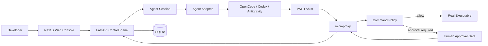

# Mica AgentOps

Mica AgentOps is a Windows-first execution governance control plane for local Coding Agent CLIs. It supervises existing agent runtimes instead of implementing another agent or a multi-agent collaboration platform.

Mica makes agent execution observable and governable through persistent sessions, run tracking, command policies, approval gates, trace evidence, and execution summaries.

> Mica is currently an open-source MVP for local development and engineering exploration. Local mode provides policy checks and audit evidence, not a strong security sandbox.

## Core Capabilities

- Start natural-language tasks with OpenCode, Codex CLI, Antigravity CLI, or the built-in mock agent.
- Continue long-running work through persistent Agent Sessions instead of rebuilding context from transcripts.
- Track each execution as a Run with status, duration, logs, events, commands, approvals, and summaries.
- Intercept supported external commands through Windows PATH shims and `mica-proxy`.
- Pause high-risk commands for human approval and fail closed when the approval service is unavailable.
- Preserve command stdout, stderr, exit code, duration, policy decision, and approval evidence.
- Handle structured text, choice, multi-choice, question, and permission interactions where the runtime exposes them.
- Stream and replay execution events through SSE.
- Explore stronger isolation with the experimental Docker execution path.

## Architecture



Mica separates long-lived work from individual execution attempts:

```text
AgentSession
  -> SessionMessage
  -> SessionInteraction
  -> Run
      -> CommandRecord
      -> CommandApproval
      -> Event
      -> RunSummary
```

- **Session** represents a persistent goal and stores the native runtime session or thread identifier.
- **Run** represents one execution turn or process invocation.
- **Command** records an external command observed through Mica's governance path.
- **Approval** records a policy-gated decision before a supported command executes.
- **Event** provides normalized trace and log evidence.
- **Interaction** represents questions, choices, permissions, or additional input requested by an agent.

See [Architecture](docs/architecture.md) for implementation details.

## Agent Support

| Adapter | One-shot runs | Native continuation | Structured interactions | Status |
| --- | --- | --- | --- | --- |
| OpenCode | Yes | HTTP server session | Questions and permissions | Primary |
| Codex CLI | Yes | Thread resume | Native events where available | Supported |
| Antigravity CLI | Yes | Process-level follow-up | No guaranteed native contract | Basic |
| Mock Agent | Yes | Deterministic test flow | Test fixtures | Supported |

OpenCode uses a server-first adapter. Mica creates or attaches to an OpenCode server session, submits turns over HTTP, consumes the global event stream, and uses message/status polling for recovery.

Codex defaults to the stable `codex exec --json` and `codex exec resume` path. An experimental `codex app-server` transport is available for deeper native thread and turn events.

## Technology Stack

- **Web:** Next.js, React, TypeScript, Tailwind CSS, shadcn/ui
- **API:** FastAPI, SQLAlchemy, Pydantic, SQLite
- **Realtime:** Server-Sent Events
- **Python tooling:** uv
- **JavaScript tooling:** pnpm
- **Execution governance:** Python command proxy and Windows `.cmd` PATH shims

## Quick Start

### Prerequisites

- Windows PowerShell
- Python 3.12+
- uv 0.11+
- Node.js 24+
- pnpm 11+
- At least one optional Agent CLI: OpenCode, Codex CLI, or Antigravity CLI

### Install Dependencies

```powershell
pnpm install
cd apps/api
uv sync
cd ../..
```

### Start Mica

Start the API:

```powershell
pnpm dev:api
```

Start the Web console in another terminal:

```powershell
pnpm dev:web
```

Open:

- Web console: <http://localhost:3000>
- API health: <http://localhost:8000/health>
- OpenAPI documentation: <http://localhost:8000/docs>

If Next.js reports that another development server is already running, use the PID shown in the error to stop the existing process before starting a new server.

## Start an Agent Session

1. Open <http://localhost:3000/sessions>.
2. Create a Session with a natural-language goal and workspace path.
3. Select an available Agent runtime.
4. Follow execution through the conversation, interactions, runs, and evidence views.
5. Answer questions or permission requests from the Session page when the agent needs user input.

Use <http://localhost:3000/runs> for isolated one-shot executions that do not require a persistent conversation.

The Web UI reads `GET /api/agent-runs/agents` to detect installed runtimes. Set an explicit executable when auto-discovery is insufficient:

```powershell
$env:MICA_OPENCODE_PATH = "C:\path\to\opencode.cmd"
$env:MICA_CODEX_PATH = "C:\path\to\codex.cmd"
$env:MICA_ANTIGRAVITY_PATH = "C:\path\to\agy.cmd"
```

To attach Mica to an existing OpenCode server:

```powershell
$env:MICA_OPENCODE_SERVER_URL = "http://127.0.0.1:4096"
```

To enable the experimental Codex app-server transport:

```powershell
$env:MICA_CODEX_SESSION_TRANSPORT = "app-server"
```

## Command Governance

Default command rules live in [policies/command-policy.json](policies/command-policy.json). A rule matches a tool and argument prefix:

```json
{
  "id": "kubectl-delete",
  "tool": "kubectl",
  "argv_prefix": ["delete"],
  "action": "require_approval",
  "risk_level": "high",
  "reason": "kubectl delete can remove cluster resources."
}
```

The repository includes Windows shims for `git`, `npm`, `terraform`, and `kubectl`. Install them and print the controlled environment configuration:

```powershell
.\scripts\install-shims.ps1
```

Apply the values printed by the script in the shell where the governed runtime will execute:

```powershell
$env:MICA_ORIGINAL_PATH = "<original PATH>"
$env:PATH = "<repo>\shims;" + $env:MICA_ORIGINAL_PATH
$env:MICA_API_BASE_URL = "http://localhost:8000/api"
```

When a matching high-risk external command reaches a shim:

1. `mica-proxy` creates a command and pending approval record.
2. The calling process blocks while the approval is pending.
3. The Web console displays the request under `/approvals`.
4. Approval executes the real binary and preserves its output and exit code.
5. Rejection returns `MICA_APPROVAL_REJECTED` with exit code `126`.
6. API failure or approval timeout fails closed without executing the command.

Only test destructive-looking commands in disposable workspaces and local fake remotes.

## API Surfaces

The complete API contract is available through `/docs`. Primary resources include:

- `/api/sessions`
- `/api/session-interactions`
- `/api/agent-runs`
- `/api/runs`
- `/api/commands`
- `/api/approvals`
- `/api/events`
- `/api/events/stream`
- `/api/docker/execute`

## Testing

Run the complete local validation:

```powershell
pnpm test
pnpm build:web
```

Individual checks:

```powershell
pnpm test:api
pnpm test:web
pnpm lint:web
pnpm build:web
```

Current baseline:

- 134 backend tests
- 6 frontend interaction and log utility tests
- ESLint validation
- Next.js production build for Dashboard, Approvals, Commands, Runs, and Sessions

Browser-level end-to-end coverage is not yet part of the automated suite. Manually verify the Session, approval, and run evidence flows before publishing a release.

## Security Boundaries

- Local governance covers supported external binaries that resolve through Mica's PATH shims.
- PowerShell and cmd built-ins such as `Remove-Item`, `del`, and `rmdir` do not resolve through PATH and are not reliably intercepted.
- Absolute executable paths, direct library calls, and hostile child processes can bypass Local mode.
- Native Agent session turns are not yet guaranteed to route every command through a run-scoped shim environment.
- Docker support is experimental and does not yet constitute a production-grade sandbox.
- Mica currently has no authentication, multi-tenancy, or remote-worker trust boundary.
- Some Codex app-server events are finalized in batches rather than streamed individually.
- A native runtime can remain busy after a child tool stalls. Automatic native-session abort and stalled-tool recovery are not yet complete.

See [Troubleshooting](docs/troubleshooting.md) for known runtime and Windows-specific issues.

## Project Structure

```text
mica/
  apps/
    api/                 FastAPI control plane
    web/                 Next.js Web console
  proxy/                 command proxy and policy logic
  shims/                 Windows command shims
  policies/              command and Docker policies
  scripts/               local setup and verification utilities
  evals/                 starter evaluation cases and results
  docs/                  architecture, compatibility, evidence, and troubleshooting
```

## Documentation

- [Architecture](docs/architecture.md)
- [Project North Star](docs/project-north-star.md)
- [Agent Compatibility Matrix](docs/agent-compatibility-matrix.md)
- [Docker Runner](docs/docker-runner.md)
- [Isolation Readiness](docs/isolation-readiness.md)
- [Troubleshooting](docs/troubleshooting.md)

Detailed experiments and historical implementation evidence remain under `docs/`; they are not part of the primary product setup flow.

## Roadmap

Near-term priorities:

1. Abort and recover stalled native Agent tools without leaving Mica and the runtime in conflicting states.
2. Apply run-scoped command governance consistently to native OpenCode and Codex Session turns.
3. Stream Codex app-server events incrementally.
4. Add Playwright end-to-end coverage for Session, approval, and trace flows.
5. Strengthen isolation through Docker, WSL2, or remote workers.
6. Add authentication, multi-tenancy, CI, and release packaging.

## License

This project is intended to be open source. Add the selected license file before the first public release.
