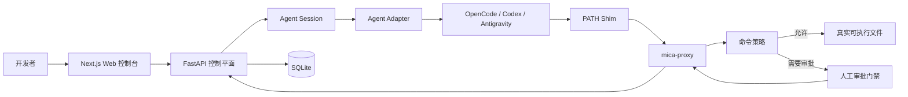

# Mica AgentOps

[English](README.md) | [简体中文](README_zh.md)

Mica AgentOps 是一个 Windows 优先、面向本地 Coding Agent CLI 的执行治理控制平面。它负责监管现有 Agent Runtime，而不是重新实现一个 Agent，也不是多 Agent 协作平台。

Mica 通过持久化会话、运行追踪、命令策略、人工审批、Trace 证据和执行摘要，使 Agent 的执行过程可观测、可治理。

> Mica 当前是一个面向本地开发和工程探索的开源 MVP。Local 模式提供策略检查和审计证据，但不是强安全沙箱。

## 核心能力

- 使用 OpenCode、Codex CLI、Antigravity CLI 或内置 Mock Agent 启动自然语言任务。
- 通过持久化 Agent Session 继续复杂工作，无需根据 Mica Transcript 重建上下文。
- 将每次执行记录为 Run，包含状态、耗时、日志、事件、命令、审批和摘要。
- 通过 Windows PATH Shim 和 `mica-proxy` 拦截受支持的外部命令。
- 对高风险命令暂停执行并等待人工审批；审批服务不可用时默认拒绝执行。
- 保留命令的 stdout、stderr、退出码、耗时、策略决策和审批证据。
- 在 Agent Runtime 提供相关事件时，处理文本、单选、多选、问题和权限交互。
- 通过 SSE 实时推送并支持回放执行事件。
- 通过实验性的 Docker 执行路径探索更强的隔离能力。

## 架构



Mica 将长期工作目标与单次执行分开建模：

```text
AgentSession
  -> SessionMessage
  -> SessionInteraction
  -> Run
      -> CommandRecord
      -> CommandApproval
      -> Event
      -> RunSummary
```

- **Session** 表示持久化工作目标，并保存 Agent Runtime 原生的 Session 或 Thread 标识。
- **Run** 表示一次执行 Turn 或进程调用。
- **Command** 记录经过 Mica 治理链路观测到的外部命令。
- **Approval** 记录受支持命令在执行前经过策略门禁产生的决策。
- **Event** 提供归一化的 Trace 和日志证据。
- **Interaction** 表示 Agent 请求的问题、选项、权限或补充输入。

实现细节参见[架构文档](docs/architecture.md)。

## Agent 支持情况

| Adapter | 单次 Run | 原生会话续接 | 结构化交互 | 状态 |
| --- | --- | --- | --- | --- |
| OpenCode | 支持 | HTTP Server Session | 问题和权限 | 主要适配器 |
| Codex CLI | 支持 | Thread Resume | Runtime 提供时支持原生事件 | 已支持 |
| Antigravity CLI | 支持 | 进程级 Follow-up | 无稳定的原生协议保证 | 基础支持 |
| Mock Agent | 支持 | 确定性测试流程 | 测试 Fixture | 已支持 |

OpenCode 使用 Server-first Adapter。Mica 创建或连接 OpenCode Server Session，通过 HTTP 提交 Turn，消费全局事件流，并使用消息和状态轮询进行恢复。

Codex 默认使用稳定的 `codex exec --json` 和 `codex exec resume` 路径。若需要更深入的原生 Thread 和 Turn 事件，可以启用实验性的 `codex app-server` Transport。

## 技术栈

- **Web：** Next.js、React、TypeScript、Tailwind CSS、shadcn/ui
- **API：** FastAPI、SQLAlchemy、Pydantic、SQLite
- **实时传输：** Server-Sent Events
- **Python 工具链：** uv
- **JavaScript 工具链：** pnpm
- **执行治理：** Python Command Proxy 和 Windows `.cmd` PATH Shim

## 快速开始

### 环境要求

- Windows PowerShell
- Python 3.12+
- uv 0.11+
- Node.js 24+
- pnpm 11+
- 至少安装一个可选 Agent CLI：OpenCode、Codex CLI 或 Antigravity CLI

### 安装依赖

```powershell
pnpm install
cd apps/api
uv sync
cd ../..
```

### 启动 Mica

启动 API：

```powershell
pnpm dev:api
```

在另一个终端启动 Web 控制台：

```powershell
pnpm dev:web
```

访问：

- Web 控制台：<http://localhost:3000>
- API 健康检查：<http://localhost:8000/health>
- OpenAPI 文档：<http://localhost:8000/docs>

如果 Next.js 提示已有开发服务器正在运行，请使用错误信息中显示的 PID 停止旧进程，然后重新启动。

## 启动 Agent Session

1. 打开 <http://localhost:3000/sessions>。
2. 使用自然语言目标和 Workspace 路径创建 Session。
3. 选择一个当前可用的 Agent Runtime。
4. 在对话、交互、Run 和 Evidence 视图中跟踪执行过程。
5. 当 Agent 需要用户反馈时，直接在 Session 页面回答问题或处理权限请求。

对于不需要持久化对话的独立单次任务，可以使用 <http://localhost:3000/runs>。

Web UI 通过 `GET /api/agent-runs/agents` 检测已安装的 Runtime。如果自动发现失败，可以显式指定可执行文件：

```powershell
$env:MICA_OPENCODE_PATH = "C:\path\to\opencode.cmd"
$env:MICA_CODEX_PATH = "C:\path\to\codex.cmd"
$env:MICA_ANTIGRAVITY_PATH = "C:\path\to\agy.cmd"
```

连接已有的 OpenCode Server：

```powershell
$env:MICA_OPENCODE_SERVER_URL = "http://127.0.0.1:4096"
```

启用实验性的 Codex app-server Transport：

```powershell
$env:MICA_CODEX_SESSION_TRANSPORT = "app-server"
```

## 命令治理

默认命令规则位于 [policies/command-policy.json](policies/command-policy.json)。每条规则根据工具名和参数前缀进行匹配：

```json
{
  "id": "kubectl-delete",
  "tool": "kubectl",
  "argv_prefix": ["delete"],
  "action": "require_approval",
  "risk_level": "high",
  "reason": "kubectl delete can remove cluster resources."
}
```

仓库包含 `git`、`npm`、`terraform` 和 `kubectl` 的 Windows Shim。运行以下脚本安装 Shim，并输出受控环境配置：

```powershell
.\scripts\install-shims.ps1
```

在需要受治理的 Runtime 所在 Shell 中应用脚本输出的值：

```powershell
$env:MICA_ORIGINAL_PATH = "<original PATH>"
$env:PATH = "<repo>\shims;" + $env:MICA_ORIGINAL_PATH
$env:MICA_API_BASE_URL = "http://localhost:8000/api"
```

当匹配规则的高风险外部命令进入 Shim 时：

1. `mica-proxy` 创建命令记录和待处理的审批记录。
2. 调用进程在审批期间保持阻塞。
3. Web 控制台在 `/approvals` 中展示审批请求。
4. 审批通过后执行真实二进制文件，并保留输出和退出码。
5. 审批拒绝后返回 `MICA_APPROVAL_REJECTED`，退出码为 `126`。
6. API 不可用或审批超时时，系统默认拒绝且不执行命令。

仅在一次性 Workspace 和本地模拟远程仓库中测试可能具有破坏性的命令。

## API

完整 API 契约可以通过 `/docs` 查看。主要资源包括：

- `/api/sessions`
- `/api/session-interactions`
- `/api/agent-runs`
- `/api/runs`
- `/api/commands`
- `/api/approvals`
- `/api/events`
- `/api/events/stream`
- `/api/docker/execute`

## 测试

运行完整的本地验证：

```powershell
pnpm test
pnpm build:web
```

单独运行各项检查：

```powershell
pnpm test:api
pnpm test:web
pnpm lint:web
pnpm build:web
```

当前测试基线：

- 134 项后端测试
- 6 项前端交互和日志工具测试
- ESLint 检查
- Dashboard、Approvals、Commands、Runs 和 Sessions 页面的 Next.js 生产构建

自动化测试暂未覆盖浏览器级端到端流程。发布版本前仍需手动验证 Session、审批和 Run Evidence 流程。

## 安全边界

- Local 治理仅覆盖通过 Mica PATH Shim 解析的受支持外部二进制命令。
- `Remove-Item`、`del`、`rmdir` 等 PowerShell 和 cmd 内建命令不经过 PATH，无法被可靠拦截。
- 绝对路径调用、直接调用程序库以及恶意子进程可以绕过 Local 模式。
- 原生 Agent Session 中的每个 Turn 尚不能保证所有命令都经过 Run-scoped Shim 环境。
- Docker 支持仍处于实验阶段，尚不构成生产级安全沙箱。
- Mica 当前没有认证、多租户或远程 Worker 信任边界。
- 部分 Codex app-server 事件会在 Turn 完成后批量落库，而不是逐条实时推送。
- 子工具卡住后，原生 Runtime 可能继续保持 Busy。自动终止原生 Session 和恢复卡住工具的能力尚未完成。

已知 Runtime 和 Windows 特定问题参见[故障排查](docs/troubleshooting.md)。

## 项目结构

```text
mica/
  apps/
    api/                 FastAPI 控制平面
    web/                 Next.js Web 控制台
  proxy/                 命令代理和策略逻辑
  shims/                 Windows 命令 Shim
  policies/              命令和 Docker 策略
  scripts/               本地配置和验证工具
  evals/                 基础评测用例和结果
  docs/                  架构、兼容性、证据和故障排查文档
```

## 文档

- [架构](docs/architecture.md)
- [项目核心定位](docs/project-north-star.md)
- [Agent 兼容性矩阵](docs/agent-compatibility-matrix.md)
- [Docker Runner](docs/docker-runner.md)
- [隔离能力准备度](docs/isolation-readiness.md)
- [故障排查](docs/troubleshooting.md)

详细实验和历史实现证据仍保留在 `docs/` 中，但不属于主要产品使用流程。

## Roadmap

近期优先事项：

1. 终止和恢复卡住的原生 Agent 工具，避免 Mica 与 Runtime 状态不一致。
2. 将 Run-scoped 命令治理完整应用到 OpenCode 和 Codex 原生 Session Turn。
3. 以增量方式流式传输 Codex app-server 事件。
4. 为 Session、审批和 Trace 流程增加 Playwright 端到端测试。
5. 通过 Docker、WSL2 或远程 Worker 增强隔离能力。
6. 增加认证、多租户、CI 和发布打包能力。

## 许可证

本项目计划以开源形式发布。首次公开发布前需要添加最终选定的许可证文件。
